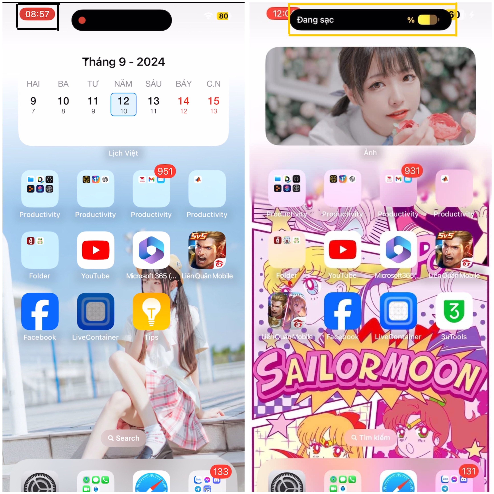
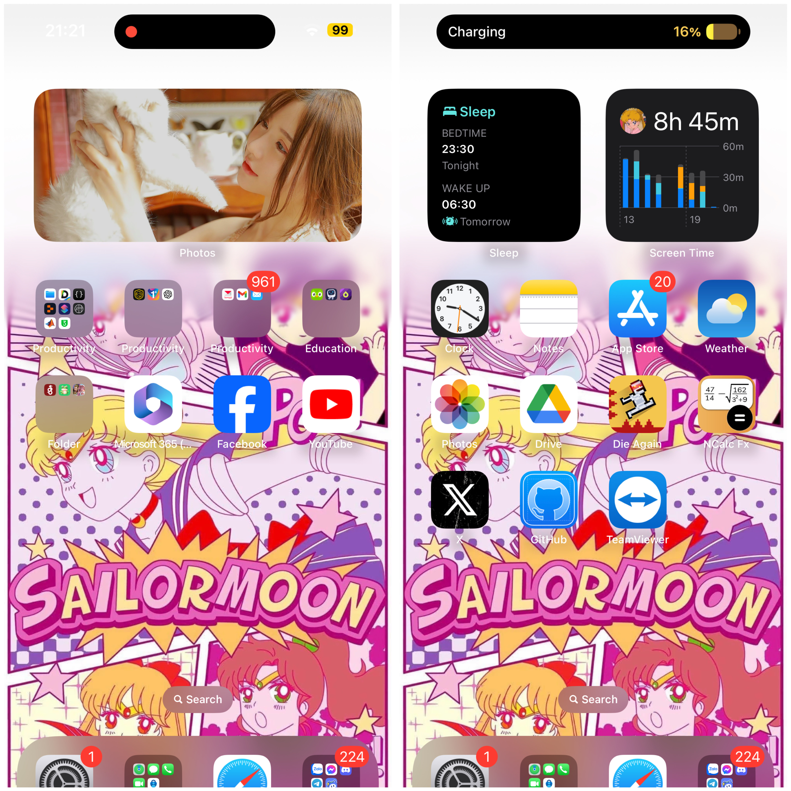

# Fixing Dynamic Island on iPhone XS Max

Are you tired of the Dynamic Island malfunctioning on your iPhone XS Max? Don’t worry, I’m here to help you fix that! This guide will help resolve common issues with Dynamic Island functionality.

## Issues Fixed:
- Dynamic Island will now display correctly when charging, just like the original.
- No more red areas appearing near the clock during screen recording.
- Smoother animations for a seamless experience.
- Dynamic Island will no longer block notifications.
## Note
This file has worked well on the iPhone XS Max running iOS 17.3.1, but I assume it will also work on other devices.
## How to Fix:

### Step 1: Download the Required Files
- Download the `com.apple.iokit.IOMobileGraphicsFamily.plist` from the [Here](./com.apple.iokit.IOMobileGraphicsFamily.plist) section of this repository.

### Step 2: Follow the Fixing Guide
- Once you have the file, follow the steps detailed on this [page](https://github.com/HorizonUnix/FixRDAR4XR11).

After following these steps, your Dynamic Island issues should be resolved, bringing back a smooth experience!

## Before and After Comparison:

### Before the Fix:

*Red areas near the clock and Dynamic Island blocking notifications.*

### After the Fix:

*No more red areas and smooth animations, with notifications unobstructed.*
## I used google translate to write this article :))))))
